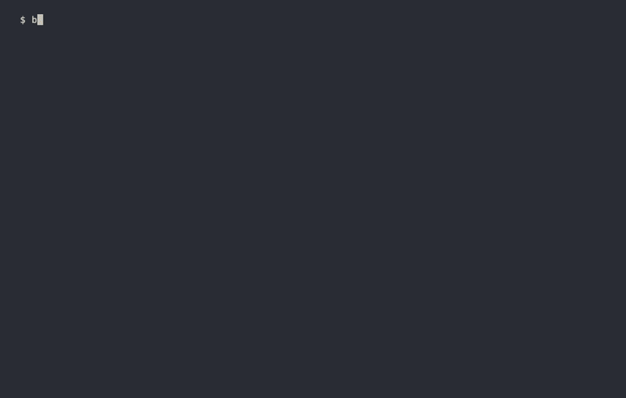

# board

One screen showing every live coding-agent session running under cmux — Claude Code and
[maki](https://github.com/tontinton/maki), in one fleet.



That is `board watch`. A session comes back asking something and lifts out of the quiet
tail, a todo is captured without leaving the tab, and `z` folds the backlog away.

The same fleet once, in plain text, for a pipe or a bug report:

```
$ board
STATE        SESSION                                      WHERE                IDLE
blocked → ⧗  merge app#1497 before branching              app                 3h00m
done         migrate auth handlers to v2                  auth                   9m
done         bump the staging image                       infra                 26m
done ⧗       ship the pricing page copy                   web                   55m
done ⧗       Review pipeline PR #541                      reviews             2h48m
done ⧗       fold the quiet band                          tools               4h05m
done ⧗       hunt the flaky payment test                  background          5h00m
done ⧗       backfill the events table                    data                7h20m
done ⧗       answer the ACME security questionnaire       docs -> acme-que…   1d04h
done ⧗       rotate the staging credentials               ops                 3d02h
running      build the csv export endpoint                api                    0m
todo         reply to the ACME csv export request                           12d ago
todo         book the quarterly review                                       1d ago

11 sessions · 1 blocked · 1 running · 8 quiet >45m · 2 todo
```

Both are a fixture, not a real fleet: every row on a real board is somebody's work, so
the demo builds a synthetic world and renders it through the same code (`demo/record.sh`,
`DESIGN.md` §16).

## Commands

    board                     print the screen once
    board watch [interval]    ambient dashboard, redraws in place (default 10s)
    board jump <substring>    focus the cmux tab whose label or workspace matches
    board label "<text>"      label the current session (no text clears it)
    board todo                list the todos, with ages and the cap
    board todo "<text>"       add one (max 10)
    board todo done <text|id> finish one, matched like jump
    board editor              which editor the ⧉ link opens (no name lists them)
    board install-hooks       wire both agents up: Claude Code hooks, and maki's init.lua
    board uninstall-hooks     take them back out, leaving every other hook alone
    board version             board's version, and claude's, cmux's and maki's
    board doctor              what board can and cannot read on this machine
    board -h                  this list, from the tool itself (`--help`, `help`)

`board watch` is meant to live in its own cmux tab. It needs no daemon and opens no
port — the tab is the process. Piped or redirected it prints one frame and exits,
so `board watch > frame.txt` works.

Inside `board watch`: `↑`/`↓` (or `k`/`j`) select a row, `Enter` focuses that
session's cmux tab **and leaves board running**, `a` adds a todo, `t` jumps to the top
of the list, `d` finishes the selected one, `z` folds the quiet band to its count,
`?` shows the legend, `Esc` clears, `q` or `Ctrl-C` exits. That is the whole keymap — no
sorting, no filtering.

`z` and `?` are the two keys that change what the frame shows rather than where the cursor is;
`?` only swaps the bottom line, so the fleet above it is untouched.
QUIET starts **open**; folded, it keeps its header and its count — `QUIET · 13 ·
collapsed` — so the backlog can be out of the way without being out of sight, and the
rows it gives back go to the bands where something is happening. Folded rows are not
selectable, because `↑`/`↓` follow the screen.

The letter keys also work on the Hebrew layout, on the same physical keys — `א` for the
list, `ש` to add, `ג` to finish, `ז` to fold, `ח`/`ל` to move. `q` is the exception: quit
from a non-Latin layout with `Ctrl-C`.

`a` opens a prompt on the bottom line: type, `Enter` adds, `Esc` cancels, and empty text
is a cancel. It is the one mode board has, and it stays deliberately dumb — no cursor
keys, just typing and backspace. **Nothing times out while you type**; the selection's
10s return does not apply, because a timer that discarded half-typed text would be worse
than a paused tab. `Ctrl-C` still exits from inside the prompt.

When QUIET does not fit, the band ends with `+N quiet`. **That is a count, not a
control** — nothing expands a band. To read a hidden row, press `↓` past the last
visible one (it walks into the collapsed rows one at a time, oldest first) or make
the tab taller. Rows with no cmux tab can be selected and read too; `Enter` on one
says there is nowhere to jump.

**While a row is selected the refresh pauses** and the header says so. Rows re-sort
as idle time grows, so a live refresh would slide the list out from under the
cursor. The selection is tracked by session, not by screen line, and clears itself
after 10s of no keypress so the tab always returns to being ambient.

## States

| state | meaning | Claude Code | maki |
|---|---|---|---|
| `blocked →` | genuinely needs an answer | interactive `status: waiting`, or background `state: blocked` | `needs_input` |
| `running` | working | `status: busy` | `working` |
| `done` | finished its turn, unnoticed | everything else | `idle` |

Rows are ordered **most recently touched first** within a band, so the top of QUIET is what you were
last doing. Todos are the exception and stay oldest-first: a session's idle time is a gap that
resets, a todo's age is a lifetime that only grows, so an old todo is a reproach and belongs at the
top of its own list.

`⧗` marks a quiet session past the idle threshold (default 45m) — it sits right after the state
mark, so `○ ⧗` reads as "quiet, and has been for a while" in one glance. An hourglass rather than
a warning triangle: a session nobody has looked at for three hours is not *wrong*, it is
**waiting**.

Both agents land on the same three words, and **the screen does not say which agent a row
belongs to.** The action is the same either way — `Enter` focuses the tab — so a column
repeating the agent on every row would cost width and answer a question you do not have.
`board doctor` counts the two rosters separately, which is where the difference matters.

## Workspaces group the rows

A cmux workspace means one of two things depending on how you work, and board draws both.

If you keep **one agent session per workspace** — the other tabs being dev servers, Storybook and
the like — nothing changes. Rows stand on their own, exactly as before.

If you keep **several sessions in one workspace**, because the workspace is the project, they sit
together under its name:

    QUIET · 4

    ▌ Checkout flow · 2 ──────────────────────────────────────────────
    ▌     ○   wire the refund webhook      41m  checkout-flow -> refund-webhook
    ▌     ○ ⧗ tidy the cart empty state  1h12m  checkout-flow -> cart-empty-state

    ▌ ○   migrate auth handlers to v2      9m  auth

      ○   bump the staging image          26m  infra

**A workspace is only named when it holds more than one session in that band.** Naming a workspace
with a single session in it would just repeat that row's own label, which is why the column was
removed in the first place.

Rows under a name are indented and sit tight against each other, with a blank line between one
group and the next — so a group reads as one block rather than as rows that happen to be adjacent.
The indent comes out of the label's own width, so every column to its right stays put.

The coloured bar down the left is the colour you gave that workspace in cmux, so the two surfaces
match. board lightens it as far as it must to stay readable on your terminal and no further, so the
hue you chose is the hue you see. A workspace you never coloured has no bar, and its name — when it
earns one — is underlined instead.

**The bands still come first.** Grouping happens inside `NEEDS YOU`, `WORKING` and `QUIET`, never
across them, so a blocked session is never buried among its quieter siblings. Within a group the
newest sits on top, and a group sorts by its newest session — the same order the band would have
used anyway.

## Four links per row — `⧆`, `⧇`, `⧉` and `⧭`

At the right-hand end of a row, `board watch` puts up to four clickable glyphs:

    ○ migrate auth handlers to v2   ▇▇▇       9m  AUTH        ⧇ ⧉ ⧬
    ○ ship the component library    ▇▇        4m  UI        ⧆ ⧇ ⧉
    ○ backfill the events table     ▇▇▇▇   7h20m  DATA          ⧉

- **`⧆` pink** — a **Storybook** listening in the session's worktree
- **`⧇` green** — the local **preview** serving that branch
- **`⧉` cyan** — its **folder**, the worktree, opened in your editor to see the branch's diff
- **`⧬` blue** — the **pull request** that branch has open (`⧭` filled once merged, red if closed)

The first three are ordered by how often a row has one, rarest first, so the folder anchors that
run and the gaps fall on the left. `⧭` sits beyond all of them because it is the only one that does
not point at this machine.

**⌘-click** them — hold Command and click. They are terminal hyperlinks, so cmux opens the http
ones in a browser tab beside the fleet and hands the folder to your editor. **board itself opens
nothing** — it only says where the three things are.

A plain click does nothing, and that is Ghostty's rule rather than board's: a link fires only
with the ctrl/super chord held, so selecting text over a row can never open something. Hovering
does underline the glyph without any modifier, which is how you can tell a row has a live link
before you reach for ⌘ — and cmux shows you the URL it points at while you hover, which names
the destination more exactly than the glyph can.

The frame says so too. The bottom line carries `⌘-click opens` whenever any row has a link, and
**`?` swaps that line for the legend** — the idle scale's rungs, and each glyph by name:

    ▇ 1h  ▇ 3h  ▇ 12h  ▇ 2d  ▇ 7d   ⧗ quiet a while   ⧆ storybook  ⧇ preview  ⧉ folder  ⧬ pr  ⧭ merged   ⌘-click   esc

Rows are spaced out with a blank line between them whenever the frame fits the tab that way, and
drawn compact when it does not — air is worth having, but never at the price of a row you wanted to
see. If you want the *terminal's* line height taller as well, that is Ghostty's setting rather than
board's: `adjust-cell-height = 30%` in `~/.config/ghostty/config`.

`?` again or `Esc` puts the keys back. It is the same line either way, so the frame never changes
height, and the refresh keeps running while you read it. On a narrow tab it sheds in order — the
scale's rungs first, then the ⌘-click reminder — rather than clipping, because the glyph meanings
are what you opened it for.

**Where a ⌘-click lands is cmux's decision, not board's.** An http link opens in a browser tab
inside cmux by default. To use your own browser instead:

    defaults write com.cmuxterm.app browserOpenTerminalLinksInCmuxBrowser -bool false

board reports which way it is set on `board doctor`'s `links` row and never writes it — silently
reconfiguring another application is not something a reporting tool should do.

Both are properties of the same thing, the **git worktree** the session is in. A session in
`.claude/worktrees/csv-export` gets that worktree's folder and that branch's preview; one in
the main checkout gets the repository and the preview running against `main`. A worktree lives
inside the main checkout on disk, so board resolves each side to its nearest `.git` rather than
comparing paths — otherwise a feature branch's dev server would show up on `main`'s row.

### `⧇` — the preview

`⧇` needs a dev server actually up, found through
[portless](https://www.npmjs.com/package/portless): board reads `~/.portless/routes.json` and
asks where each route's process is working. Run your dev server under portless and the link
appears on the matching row within a tick.

    $ cd ~/work/repo && portless run npm run dev
    🌐 https://repo.localhost

portless is optional, exactly as maki is — without it every row still carries its folder. Two
dev servers inside one worktree resolve to the one nearest the session's own directory, and a
row shows one preview, never a list.

### `⧆` — the Storybook

Storybook registers with nothing — no proxy, no state file, no roster command — so board finds
it by its port. It looks for a JS runtime listening anywhere in **6006 to 6020**, which is
Storybook's default and the range it walks into when each port is busy, and joins it to a row
the same way: same worktree.

The range is closed on purpose. TensorBoard defaults to 6006 and increments the same way, so an
open-ended `6006 and up` would eventually put a Storybook link on a row that has no Storybook —
and board pairs the range with a process check for exactly that reason. Fifteen ports is more
than anyone runs at once. The link is `http://localhost:<port>`; a Storybook you have put behind
TLS is one you have put behind portless, and it shows up as `⧇` instead.

Nothing to install and nothing to configure — run `npm run storybook` and the glyph appears on
the matching row within a tick.

### `⧬` — the pull request

Nothing to install and nothing to configure: **cmux has already worked this out.** It polls GitHub
and shows a badge per tab in its sidebar, and board reads the same badge — so no network request of
board's own, no credential, no `gh`, no config key.

The state comes with it, and the three read differently:

| glyph | means |
|---|---|
| `⧬` blue, hollow | **open** — somebody still has to do something about it |
| `⧭` blue, filled | **merged** — it landed; the link is context now |
| `⧬` red | **closed** — a branch somebody abandoned |

A slot the row has nothing for shows `⧅` in a very faint grey, so a cell with two of its four links
reads as sparse rather than broken. It is not clickable, and a row with no links at all shows no
cell.

Shape carries *has it landed* and colour carries *did it land anywhere*, so missing one cue still
leaves the other. A draft shows as open: GitHub keeps draft-ness in a separate field that cmux does
not read (`DESIGN.md` §10.13).

cmux answers per **workspace**, so board checks the branch before drawing it. A session working in
a linked worktree sits in a workspace whose own directory is usually on another branch, and taking
cmux's answer unchecked put one branch's pull request on another branch's row. If board cannot
confirm the branches match, it draws nothing — a link that looks like this session's work and is
not is worse than no link. Two sessions on the same branch share its pull request, correctly, and a
background agent with no tab has none.

### `⧉` — the folder, in your editor

Three editors work, because each registers a URL scheme that takes a path — which is what lets
board hand one over and run nothing:

| name | app | opens |
|---|---|---|
| `cursor` | Cursor | `cursor://file/…` |
| `vscode` | Visual Studio Code | `vscode://file/…` |
| `zed` | Zed | `zed://file/…` |

**You do not have to configure anything.** board uses the one you have installed, and when
several are installed it takes the first of the three above — alphabetically, deliberately,
because board has no opinion about which editor is better. `board editor` says what it picked
and what else is here:

    $ board editor
      folder links open  Cursor.app   cursor://   (automatically)

      → cursor   Cursor.app
        vscode   Visual Studio Code.app
        zed      not installed

      change it:  board editor vscode

`board editor zed` pins your choice in `~/.board.json`, and `board editor auto` hands it back.
A name board does not know is refused with the list, and a name whose app it cannot find is
still honoured — you may have it installed somewhere board does not look — with `zed, not
installed here` on the `board doctor` line so you can see why a click might go nowhere.

It is a command and not a prompt because **board never learns that you clicked a link.** The
terminal opens it and tells board nothing, so there is no "first time this was opened" to hang
an *open with* panel on; the question has to be answerable at any time instead. With none of
the three installed there is no `⧉` at all, rather than a glyph that opens nothing.

The links are in the dashboard only: plain `board` output goes into pipes and bug reports, and
a branch-derived hostname is work data. `board doctor`'s `links` row is where to look when a
glyph is missing.

## Todos

A todo is work with **no session behind it** — the customer request you have not
started, so there is no tab for board to find. It carries text and an age and nothing
else: no status, no priority, no due date.

    TODO · 3 of 10
             ▫ reply to the ACME csv export request               12d ago
             ▫ review the export PR                                1d ago
             ▫ book the quarterly review                              now

With nothing on it the band still appears, as `TODO  nothing on your list` — an unused
feature that renders nothing is one you never find. The list is drawn last, after the
whole fleet, because it is not a state a session can be in. It has **no bar and no workspace**: a bar means idle time, which is a gap that
resets when a session is touched, while a todo's age is a lifetime that only grows —
hence `12d ago` rather than `12d00h`. The header states the cap so you can watch it
climb.

Press `a` inside `board watch` to add one without leaving the tab, or from any shell:

    $ board todo "reply to the ACME csv export request"
    todo: reply to the ACME csv export request  (1 of 10)

**The list holds 10, and the 11th is refused rather than trimmed.** That is the point,
not a limitation: a list that can grow without end is a backlog, and a backlog belongs
in your issue tracker. The refusal is what makes you decide.

Nothing links a todo to a session yet, so
if you start the work, remove the todo — board will not notice the overlap for you.
There is no undo: the header reports the text it removed, so a mis-key costs one line
of retyping.

Claude Code rows come from `claude agents --json`, which knows every live session. cmux
supplies tab titles, workspace names and the idle clock, joined on pid. The location column is
git's rather than cmux's — the repository, and the worktree inside it in green when the session
is in one — because cmux names a workspace per agent task, so its title tends to repeat the row's
own label. Background agents
(`claude --bg`) appear with `background` in the location column — they have no tab,
so they cannot be jumped to, and their label is the open question Claude Code
records for them.

Interactive sessions with no cmux surface are subagents or sessions started outside
cmux; they are not rows, because this board is a view of tabs. The same rule applies to a
maki started outside cmux.

**Why `done` and not `waiting`:** cmux's `needsInput` lifecycle fires ~60 seconds
after *any* finished turn, so it means "sitting at the prompt", not "asked you
something" — on a typical fleet it covers most sessions. `blocked` is derived from
unresolved Feed cards instead, so it stays rare and worth reacting to.

**Cost:** `claude agents` takes ~250ms, so `board` runs in ~220ms rather than the
~60ms it managed when it derived state from cmux alone. That buys 10 sessions it
used to miss, including background agents blocked for weeks.

## maki

maki sessions are rows like any other — same three states, same bands, same `Enter` to
jump. Getting them takes one more step, because **maki has no roster command.** Its
sessions live inside the running process, and the only way in is maki's Lua plugin API.

So `board install-hooks` installs a plugin. It prepends a marked block to the `init.lua`
maki loads (`~/.config/maki/init.lua`, or `~/.maki/init.lua` if you have one) and writes a
`plugin.toml` beside it granting the block the two permissions it uses. From then on, every
time a session changes state maki writes what it knows to
`~/.board/maki/<cmux surface id>.json`, and board reads that.

    $ board install-hooks
    installed hooks: Stop, Notification
    installed maki hook: /Users/you/.config/maki/init.lua
    granted it fs_write and env: /Users/you/.config/maki/plugin.toml

Three things worth knowing about it:

- **The block is prepended, not appended.** A maki `init.lua` ends in `return { … }`, and
  in Lua nothing may follow a `return` — an appended hook would be a syntax error in the
  file that starts maki. Your own Lua survives verbatim below it, a timestamped
  `.board-bak-*` copy is taken first, and running it twice changes nothing.
- **`plugin.toml` is half the install.** maki denies every permission to an `init.lua`
  with no manifest beside it, so without that file the block installs and silently does
  nothing (`EVIDENCE.md` §9.32). If you already have one, board leaves it alone and tells
  you the block needs `fs_write` and `env` in it.
- **maki is optional.** Without it installed, nothing above happens and nothing complains
  — board reports on whichever agents are on the machine.

One maki process holds every session you have opened in its tab, so **one tab can be
several rows.** `Enter` on any of them focuses the tab; maki does not expose a
per-session jump to anything outside itself.

A maki row's idle clock is maki's own `updated_at` for that session, and its label is the
session title maki gave it — the same precedence claude rows follow (your label first, then
the agent's name for it, then the tab title, then the directory).

**maki not reporting · board doctor** on the screen means a maki is running in a tab and
board has no reports at all: run `board install-hooks`.

## Install

    go install github.com/zalts1/dashy/cmd/board@v1.0.0-beta.1

**Pinned, and deliberately not `@latest`.** Go's `@latest` skips pre-release tags whenever a
release exists, so it would quietly hand you `v0.2.0` — a build with none of this. The pin comes
off and `@latest` goes back in the moment `v1.0.0` is cut.

Or from a clone:

    go build -o board ./cmd/board

Requires macOS, [cmux](https://github.com/manaflow-ai/cmux), and at least one of Claude
Code and [maki](https://github.com/tontinton/maki) — board reads its rows from the agents
and its tabs from cmux, so it has nothing to report without cmux and something to report on.
[portless](https://www.npmjs.com/package/portless) is optional and adds only the `⧇` link, one
of Cursor, VS Code or Zed is what `⧉` opens, and `⧆` needs nothing but a Storybook running.

**Verified against Claude Code 2.1.235, cmux 0.64.22 and maki 0.4.9** — the versions this
release was cut against. None of the three is a documented contract, so a patch release on
any of them can move what board reads; `board doctor` reports what is on your machine, and
a mismatch is the first thing to check.

No dependencies, no daemon, no port, no telemetry, and no network of its own — the only
request board can make is a `notify_cmd` you wrote yourself. `board watch` in a dedicated
tab is the whole runtime.

Substitute any other tag to pin a different one. Either way the binary knows what
it is, with no build flags, and reports what it depends on beside it:

    $ board version
    board  v1.0.0-beta.1
    claude 2.1.235 (Claude Code)
    cmux   0.64.22 (102) [ddd4a01bc]
    maki   0.4.9

**Quote all four in a bug report.** board reads its rows from the agents and its tabs from
cmux, and none of those surfaces is a documented contract — the three upstream lines are
usually the answer. A tool that could not be asked reads `not found`, which for maki is
the ordinary case rather than a problem; a board built outside a git tree reads `(devel)`,
which says how it was built rather than hiding it.

## When the board looks wrong — `board doctor`

    $ board doctor
    board  v1.0.0-beta.1
    claude 2.1.235 (Claude Code)
    cmux   0.64.22 (102) [ddd4a01bc]
    maki   0.4.9
    roster 16 claude sessions · 3 maki sessions in 2 tabs
    tabs   22 tabs in 7 workspaces
    links  2 portless routes · 1 storybook · vscode · 3 prs, 1 open · cmux browser
    hooks  Stop, Notification · maki init.lua
    config /Users/you/.board.json
    notify off — set notify_cmd to push

Ten lines saying what board can and cannot read here. `roster` is both agents' rosters —
`claude agents --json`, then what maki has reported — and `tabs` is cmux. **`16 claude
sessions` with `0 tabs` is the interesting failure**: board joins the two on pid and drops
any interactive session with no tab, so a fleet that looks too small usually means the tabs
did not arrive.

`roster` and `hooks` each carry both agents rather than each agent getting a row, and on a
machine without maki they say nothing about it — the version block above has already. The
maki halves worth recognising:

    roster 16 claude sessions · 2 maki running, no reports    ← install-hooks was never run
    hooks  Stop, Notification · maki init.lua without plugin.toml   ← installed and inert

`links` is the row to check when `↗` or `⧉` is missing from a row you expected it on, and it
carries both halves — the preview read, then the editor the folder opens. The preview half has
the same two-halves shape `roster` does, because `routes.json` outlives the dev servers it
names:

    links  no portless — rows link to folders only · cursor    ← portless is not installed
    links  portless installed, no routes up · cursor           ← nothing is running
    links  3 portless routes, none live · cursor               ← stale file; no row gets ⧇
    links  1 portless route · no editor — board editor         ← no ⧉ on any row
    links  1 portless route · zed, not installed here          ← ⧉ is drawn and may miss
    links  1 route · 2 storybook ports outside every worktree · cursor   ← no ⧆ on any row

The storybook clause appears only when something is listening in the range, since board scans
it whether or not you use Storybook.

It reads and never writes, so it works on a machine where `install-hooks` refuses. It
**never prints `notify_cmd`**, only whether one is set: this output is meant to be
pasted, and that field is a shell command that often carries a webhook URL.

An empty board and an unreadable one are different reports, and the screen says which:

    claude not found · board doctor

That line takes the header's own slot in `board watch` and leads the one-shot table, in
place of the session count. `no sessions` means board looked and the fleet is quiet.

It reports the most fundamental fact it has room for, and there is an order: the claude
roster, then cmux, then maki. A missing `claude` stops being reported once maki is
reporting — board has a fleet on screen, and the tool you did not install was a choice.

## Config — `~/.board.json`

```json
{
  "config": {
    "idle_threshold_minutes": 45,
    "poll_seconds": 10,
    "notify_cmd": "curl -sS -d @- https://ntfy.sh/my-topic",
    "editor": "cursor"
  },
  "labels": { "<cmux surface id>": "<label>" },
  "todos": [
    { "id": "2483b5", "text": "reply to the ACME csv export request", "created": "2026-07-29T13:49:09+03:00" }
  ]
}
```

`notify_cmd` runs via `sh -c` on every `Stop` and `Notification` hook and receives
this JSON on stdin. Empty (the default) means notifications are off.

```json
{
  "event": "Notification",
  "state": "needs input",
  "label": "migrate auth handlers to v2",
  "workspace": "AUTH",
  "surface_id": "D39C7A0C-…",
  "cwd": "/Users/you/work/repo",
  "message": "Claude needs your permission to use Bash",
  "text": "needs input — migrate auth handlers to v2 [AUTH]: Claude needs your permission to use Bash"
}
```

Use `.text` for a ready-made one-liner; it always carries the label and workspace
name. Sink failures are swallowed and the sink gets **3 seconds**, so neither a broken
webhook nor a hanging one blocks an agent: `notify` runs inside the agent's own hook
chain, where a command that waits costs the same as a command that fails.

## Uninstall

    board uninstall-hooks

Removes board's `Stop` and `Notification` entries from `~/.claude/settings.json` and
nothing else — other tools' hooks, other settings, and the file's permissions all
survive. A timestamped `.board-bak-*` copy is written first, an existing backup is never
overwritten, and running it twice is a report rather than an error. It refuses a
settings file it cannot parse, exactly as `install-hooks` does: board cannot safely edit
what it cannot read.

On the maki side it takes the block back out of `init.lua`, byte for byte, and clears
`~/.board/maki`. The `plugin.toml` goes only while it is still the one board wrote — if you
have edited it, it is yours and it stays. An `init.lua` left holding nothing but whitespace
is removed outright, since board is the one that created it.

Then delete `~/.board.json` and the binary. **Labels and todos live only in
`~/.board.json`**, so copy anything on the list out first; nothing else is written.
